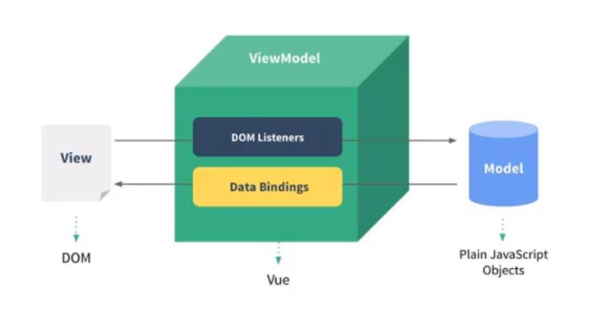
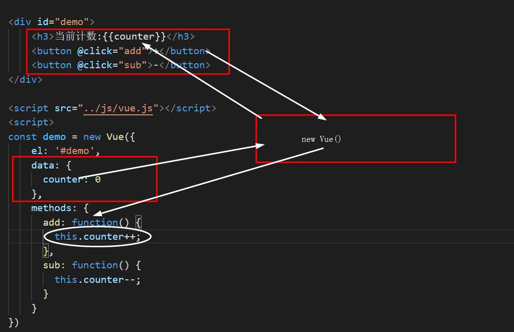

#### 最初的栗子  
```
/* HTML */
<div id="demo">
    <p>{{text}}</p>
</div>

/* Vue */
const demo = new Vue({    // 新建 Vue 对象实例
    el: '#demo',          // 用于挂载被管理的元素，可以是string（CSS 选择器）或 Element
    data: {               // 定义数据
        text: 'Hey, man!'  
    }
})
```
:snowflake: 所有的挂载元素会被 Vue 生成的 DOM 替换。因此不推荐挂载 root 实例到 <html\> 或者 <body\> 上。   
:herb: Vue 能管理挂载元素及其 DOM 结构上其子树的内容。

#### Vue列表显示
```
/* HTML */
<div id="demo">
    <p>{{text}}</p>
    <ul>
        <li v-for="item of colors">{{item}}</li>  // 迭代数组，并将每一个元素解析到对应位置
    </ul>
</div>

/* Vue */
const demo = new Vue({
    el: '#demo',
    data: {
        text: 'Hey, man!',
        colors: ['red','yellow','blue','slategrey']
    }
})
```
:snowflake: Vue 实例内部的 option 之间以 `,` 分隔，其中的 data 内部同样以 `,` 分隔。  
:snowflake: 最强大的地方在于它可以通过在控制台对 `demo.colors` 使用数组方法来控制列表。  
:snowflake: Vue 实例也代理了 data 对象上所有的 property，因此访问 `vm.a` 等价于访问 `vm.$data.a`。

#### 一次性计数器  
```
/* HTML */
<div id="demo">
    <h3>当前计数:{{counter}}</h3>
    <button v-on:click="add">+</button>
    <button @click="counter--">-</button>    // 直接对 data 中的数据进行操作
</div>

/* Vue */
const demo = new Vue({
    el: '#demo',
    data: {
      counter: 0
    },
    methods: {            // 用于在 Vue 对象中定义方法；为对象类型
      add: function() {
        this.counter++;
      }
    } 
})
```
:snowflake: `v-on:` ，用于监听某个元素的点击事件，可以简写为 `@`。    
:snowflake: data 中的数据用到 Vue 对象的其他选项中需要加前缀 `this.` ，加到 HTML 元素中，则不需要。    
:bug: data 内部的最后不要加上 `;`，会导致一些问题。  

#### Vue中的MVVM  

  

- View层：视图层  
- Model层：数据层  
- VueModel层：视图模型层
  + 实现了数据绑定，将 Model 的改变**实时**的反应到 View 中    
  + 实现了 DOM 的事件监听。当 DOM 中发生一些事件时，会被它监听到，并在需要的情况下改变对应的 Data  

  

#### 生命周期钩子  
> 每个 Vue 实例在被创建时都要经过一系列的初始化过程，在这些过程当中也会运行一些叫做生命周期钩子的函数，可以给这些钩子**添加函数**，它们将会被用作回调。  

```
/* Vue */
const demo = new Vue({
    el: '#demo',
    created: function() {
        console.log('created');
    }
})
```

----

### 插值  

#### 文本   
> 即 Mustache 语法 (双大括号)，会将数据解释为普通文本。    
```
<div id="demo">
    <h3>{{type + ' ' + name}}</h3>
    <h3>明年{{counter + 1 + '岁'}}</h3>
</div>

/* Vue */
const demo = new Vue({
    el: '#demo',
    data: {
        type: 'dog',
        name: 'sunny',
        counter: 17
    }
})
```

v-once指令  
> 能执行首次的插值，但当数据改变时，插值处的内容不会更新。
```
<div id="demo">
    <h3 v-once>{{message}}</h3>
</div>
```

#### 原始HTML  
> 可以输出真正的 HTML。  

```
<p v-html="url"></p>

/* Vue */
const demo = new Vue({
    ...
    data: {
        url: '<a href="www.bilibili.com">bilibili</a>'
    }
})
```

:bug: **绝不要**对用户提供的内容使用插值，很容易导致 XSS 攻击。  

#### v-text  
> 更新（替换）元素的 textContent。  

```
<p v-text="lalala">被替代了</p>
```

#### v-pre  
> 跳过这个元素和它的子元素的编译过程。可以用来显示原始 Mustache 标签，就像是取消了数据绑定。  

```
<span v-pre>{{ this will not be compiled }}</span>
```
#### v-cloak  
> 保持在元素上直到关联实例结束编译（即消失）。    

这个指令可以隐藏未编译的 Mustache 标签直到实例准备完毕。

```
/* CSS */
[v-cloak] {
  display: none;
}


/* HTML */
<div v-cloak>
  {{ message }}
</div>
```
:snowflake: 届时，当网页卡顿时，就不会将未编译的 Mustache 标签显示出来。

#### 动态绑定属性  
> 使用 `v-bind` 指令，可以按需求更新属性的值。  

```

<a :href="aHref">某个网站</a>

/* Vue */
const demo = new Vue({
    ...
    data: {
        myImg: '<a href="www.bilibili.com">bilibili</a>',
        aHref: 'wwww.bilibili.com'
    }
})
```
:snowflake: `v-bind` 的语法糖形式为 `:` 

布尔属性  
```
// 布尔属性
<button :hidden="isActive">Button</button>

/* Vue */
const demo = new Vue({
    ...
    data: {
        isActive: true
    }
})
```
:snowflake: 如果 isActive 的值是 null、undefined 或 false，则对应的布尔属性不会被包含在渲染出来的 <button\> 元素中。

#### 绑定class  
> 在将 `v-bind` 用于 `class` 和 `style` 时，Vue.js 做了专门的增强。表达式结果的类型除了字符串之外，还可以是对象或数组。

**#对象语法**
```
// 对象语法
<p :class="{active: isActive}">abc</p>
// 和普通的类可以同时存在，不冲突
<p class="top" :class="{active: isActive, line: isLine}">def</p>

// 嫌长可以将对象抽出来
<p class="top" :class="getClasses()">def</p>

// 添加事件处理程序
<button v-on:click="btnClick">按钮</button>

/* Vue */
const demo = new Vue({
    ...
    data: {
        isActive: true,
        isLine: false
    },
    methods: {
        btnClick: function() {
            this.isActive = !this.isActive
        },
        getClasses: function() {
            return {active: this.isActive, line: this.isLine}
        }
    }
})
```

**#数组语法**   
```
<p  class="app" :class="['top', class1]">asdf</p>

/* Vue */
const demo = new Vue({
    ...
    data: {
        class1: 'active'
    }
})
```

#### 绑定style  

**#对象语法**
 对象 | 键 | 值
 :-: | :-: | :-:
 class | 类名 | 布尔值（变量）
 style | 属性名 | 属性值（字符串或变量）
   
```
<p :style="{fontSize: '50px'}">abc</p>
<p :style="{fontSize: fontSize, color: currentColor}">abc</p>
<p :style="style1">abc</p>
<p :style="{fontSize: fontSize2 + 'px'}">abc</p>
      
/* Vue */
const demo = new Vue({
    ...
    data: {
        fontSize: '50px',
        fontSize2: 50,
        currentColor: 'red',
        style1: {
            fontSize: '50px',
            color: 'red'
        }
    }
})      
```
:snowflake: 属性用驼峰式大小写。  
:snowflake: 对于对象中的值，加引号视为字符串，否则视作变量。

**#数组语法**   
> 可以将多个样式对象应用到同一个元素上。 

```
<div v-bind:style="[style1, style2]"></div>
```

#### 计算属性  
> 对于任何复杂逻辑，都应当使用计算**属性**。  

```
/* HTML */
<p>{{fullName}}</p>
<p>{{getFullName()}}</p>

/* Vue */
const demo = new Vue({
    ...
    data: {
        firstName: 'Li',
        lastName: 'Yeoo'
    },
    computed: {
        fullName: function() {
            return this.firstName + ' ' + this.lastName
        }
    },
    methods: {    
        getFullName() {     // ES6语法糖
            return this.firstName + ' ' + this.lastName
        }
    }
})  
```
:snowflake: 不同于 `methods`，写在 HTML 中的计算属性，不用加括号。  
:snowflake: 在取名时，计算属性与方法也会存在一些差别。  

计算属性默认只有 `getter`，不过在需要时你也可以提供一个 `setter`。
```
computed: {
  fullName: {
    get: function () {
      return this.firstName + ' ' + this.lastName
    },
    set: function (newValue) {
      var names = newValue.split(' ')
      this.firstName = names[0]
      this.lastName = names[names.length - 1]
    }
  }
}
```

#### 计算属性缓存 vs 方法  
> 使用计算属性可以节省性能开销。

- 计算属性是基于它们的响应式依赖进行**缓存**的。只在相关响应式依赖发生改变时它们才会重新求值。  
- 每当触发重新渲染时，调用方法将总会再次执行函数。

#### 事件监听的参数
> 对于复杂的事件处理逻辑，可以在 `methods` 对象中定义方法。  

```
/* 方法不需要参数，可以省略括号 */
<button @click="btnClick()">按钮</button>
<button @click="btnClick">按钮</button>

/* 方法需要参数 */
<button @click="btnClick(123)">按钮</button>
<button @click="btnClick()">按钮</button>      // undefined
<button @click="btnClick">按钮</button>        // 默认将 event 事件对象作为参数

/* 方法需要 event 事件对象和其他参数 */
<button @click="btnClick(123，$event)">按钮</button>
```
:snowflake: 可以用特殊变量 `$event` 把原始的 DOM 事件传入方法。

#### v-on修饰符  

```
<button @keyup.enter="onEnter">按钮</button>
```

 修饰符 | 说明
 :-: | :-: 
 .stop | 阻止时间冒泡
 .prevent | 阻止默认行为，可不添加事件
 .{keyCode|keyAlias} | 监听特定按键
 .once | 只触发一次回调

#### 条件渲染  

```
/* HTML */
<p v-if="score>90">优秀</p>
<p v-else-if="score>80">良好</p>
<p v-else-if="score>60">及格</p>
<p v-else>不及格</p>
      
/* Vue */
data: {
    score: 87
}     
```
:snowflake: 这种情况用 `计算属性` 处理更合适，但是如果需要渲染不同的模板，可能就需要用到条件渲染。

#### 用 key 管理可复用的元素
> Vue 会尽可能高效地渲染元素，通常会复用已有元素而不是从头开始渲染。

```
<template v-if="loginType === 'username'">
  <label>Username</label>
  <input placeholder="Enter your username" key="username-input">  // 拥有不同 key 值的元素将不会复用
</template>
...
```
:snowflake: 现在，每次切换时，输入框都将被重新渲染。

#### v-if vs v-show  
> `v-show` 指令也是根据条件展示元素。

 修饰符 | 说明 | 优势
 :-: | :-: | :-: 
 v-if | 初始渲染时条件为假，则什么也不做 | 较少的初始渲染开销
 v-show  | 简单地切换元素的 `display` 属性 | 较少的切换开销，利于频繁地切换
 
#### v-for遍历数组和对象  

格式：`item in items`

```
/* 遍历数组 */
<li v-for="item in niuEr">{{item}}</li>

<li v-for="(item, index) in niuEr">{{item}}-{{index}}</li>

/* 遍历对象 */
<li v-for="value in niuEr">{{item}}</li>

<li v-for="(value, key, index) in niuEr">{{item}}</li>

/* Vue */
data: {
    niuEr: {
        Name: 'pangNiu',
        age: 23,
        school: 'shenDa University'
    }
}
```
> 其中作为参数的 item 等，可以用其它变量表示。

#### 维护状态  
> 使用 `key` 是为了某些情况能更高效的更新虚拟 DOM。

当 Vue 正在更新使用 v-for 渲染的元素列表时，它默认使用“就地更新每个元素”的策略。

建议尽可能在使用 v-for 时提供拥有**唯一值**的`key`，它是 Vue 识别节点的一个通用机制，从而重用和重新排序现有元素。

```
/* 遍历数组 */
<li v-for="item in niuEr" :key="item.id">{{item}}</li>
```
 
#### 数组变更方法  
> Vue 将被侦听的数组的变更方法进行了包裹，所以它们也将会触发视图更新。

- push()
- pop()
- shift()
- unshift()
- splice()
- sort()
- reverse()

:bug: 由于 JavaScript 的限制，Vue 不能检测数组和对象的变化（如更改某个索引的值）。  

#### 购物车清算——补给

1. 当在对象/数组循环中，需要用到元素的索引时，在 `v-for` 传入即可获取。  
2. 使用过滤器，可以格式化数据。   
```
{{totalPrice | showPrice}}

/* Vue */
/* 过滤器，将 | 前的值作为参数 */
filters: {
    showPrice(price) {
        return '￥'+ price.toFixed(2); 
    }
}
```  
3.保留小数：`toFixed()`    
4.很多时候，遍历数组元素 `for-in` 要比遍历索引值`for-of`更方便。 

----

#### 表单输入绑定  
> 可以用 `v-model` 指令在表单元素上创建**双向**数据绑定。

 适用元素 | 说明
 :-: | :-:
 <input\> | radio、checkbox、text等
 <textarea\> | 文本区域
 <select\> | 单选或多选下拉菜单
   
```
/* 语法糖 */
<input type="text" v-model="message">

/* 等价于 */
<input type="text" :value="message1" @input="message1 = $event.target.value">
```
:snowflake: `v-model` 会忽略所有表单元素的一些初始值，将 Vue 实例的数据作为数据来源。故应该在组件的 `data选项` 中声明初始值。

#### 结合radio类型使用  
> 

```
<label>
    <input type="radio" value="男" v-model="message">男孩
</label>
<label>
    <input type="radio" value="女" v-model="message">女孩
</label>

/* Vue */
data: {
    message: '女'
}
```
:snowflake: 为了让选项互斥，一般会给它们加上拥有相同值的 `name` 属性，这里用 `v-model` 也可以达到同样效果。  


```
<label for="male">
    <input type="radio" id="male" value="男" v-model="message">男性
</label>
<label for="female">
    <input type="radio" id="female" value="女" v-model="message">女性
</label>
```
:snowflake: `label` 中的 for 和 `input` 中的 id 相同时会形成关联。

#### 结合checkbox类型使用  

```
/* 单选框 */
<input type="checkbox" v-model="message">已阅读并同意相关协议

/* 复选框 */
<input type="checkbox" value="篮球" v-model="hobbies">篮球
<input type="checkbox" value="足球" v-model="hobbies">足球
<input type="checkbox" value="乒乓球" v-model="hobbies">乒乓球
<input type="checkbox" value="羽毛球" v-model="hobbies">羽毛球
    

/* Vue */
data: {
    message: false,
    hobbies: []
}
```    
:snowflake: 单选框的值为布尔值。  

#### 结合下拉菜单  

```
/* 单选 */
<select  v-model="fruit">
    <option value="菠萝">菠萝</option>
    <option value="西瓜">西瓜</option>
    <option value="水蜜桃">水蜜桃</option>
    <option value="芒果">芒果</option>
</select>
<p>最爱吃：{{fruit}}</p>

/* 多选 */
<select v-model="fruits" multiple>
    <option value="菠萝">菠萝</option>
    <option value="西瓜">西瓜</option>
    <option value="水蜜桃">水蜜桃</option>
    <option value="芒果">芒果</option>
</select>
<p>喜欢吃：{{fruits}}</p>

/* Vue */
data: {
    fruit: '水蜜桃',
    fruits: []
}
```  

#### 值绑定  

```
<label v-for="item in fruits">
    <input type="checkbox" :value="item" v-model="likeFruit">{{item}}
 </label>
<p>{{originFruit}}</p>
    
/* Vue */
data: {
    fruits: ['水蜜桃','菠萝','香蕉','哈密瓜'],
    likeFruit: []
}
```
> 这里 data 中有两个数组，一个负责初始化选项，一个负责初始化选中。

#### v-model修饰符  

 修饰符 | 说明
 :-: | :-: 
 .lazy | 转为在 `change事件` 之后进行同步（回车、失去焦点）
 .number | 自动将用户的输入值转为数值类型 
 .trim | 自动过滤用户输入的首尾空白字符
 
:snowflake: 正常情况下，`v-model` 绑定的数据即使是数值类型，也会被转化为字符串类型。  

----

#### 组件基本步骤  

1.创建组件构造器  
2.注册组件    
3.使用组件（在 Vue 实例的作用范围内）
 
```
/* HTML */
/* 在被挂载的元素中使用组件 */
<div id="demo">
    <my-cpn></my-cpn>
</div>

/* 创建组件构造器对象 */
const cpnConstructor = Vue.extend ({
    template: `
        <div>
            <h2>大家好</h2>
            <p>今晚去吃好吃的不</p>
        </div>`
});

/* 注册组件 */
Vue.component('my-cpn', cpnConstructor);  // 第一个参数为模板标签
```
:snowflake: `template`模板 定义的元素要放在一个根元素中。


