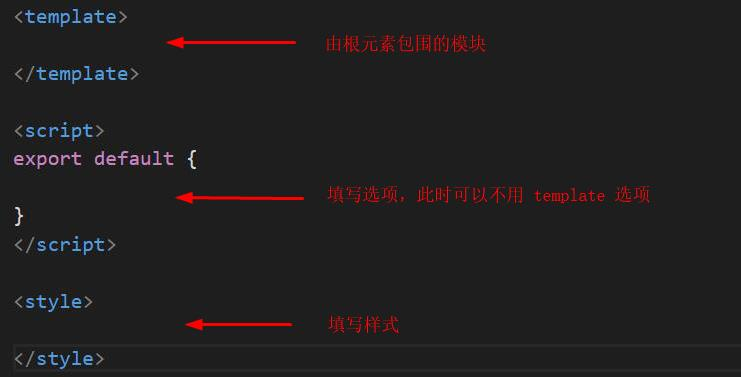

#### JavaScript原始功能  

多人开发时，引入多个 `.js` 文件特别是其中包含的全局变量会导致混乱。  

**#实现模块化**
> ES5 及以前，只能通过下面这样通过匿名函数实现闭包（立即执行）的方式来避免全局变量的问题。

```
(function() {
    var hi = 'nihao';
    var show = function() {
        document.write('from a.js');
    }
})()
```

但此时，其它 `.js` 文件要复用这些变量，只能重新创建。所以最好将需要的变量返回到一个对象中，用模块专属的全局变量接受。  

```
/* a.js */
var adata = (function() {
    var out = {};
    var hi = 'nihao';
    var show = function() {
        document.write('from a.js');
    }

    out.hi = hi;
    out.show = show;
    return out;
})()

/* b.js */
;
(function() {
        adata.show();
        console.log(adata.hi);
})()
```
:snowflake: 在每个 `.js` 文件开头加上 `;`，可以避免引用时的一些冲突。

**#CommonJS规范**
> 这种模块化规范被 Node.js 很好的实现了。当然了，缺乏底层支撑原生的 Javascript 不能直接这样做。

```
/* 从a.js导出 */
var hi = 'nihao';
var show = function() {
    document.write('from a.js');
}

module.exports = {
    hi,
    show
}

/* 从b.js导入 */
let {hi, show} = require('./a.js')
```
:star2: 这里使用了 ES6 的对象字面量的增强写法和对象解构。

**#ES6方法**

1. `module` 类型能够将作用域隔离，因此哪怕在文件中使用 `var` 也不会产生冲突。  
2. 为了能够从其它文件获取需要的数据，需要通过 `export` 关键字导出，`import` 关键字导入。

```
/* index.html */
<script src="a.js" type="module"></script>
<script src="b.js" type="module"></script>

/* a.js */
let hi = 'nihao';
let show = function() {
    alert('from a.js');
}

export {
    hi, show
}

/* b.js */
import {hi, show} from "./a.js";

show();
console.log(hi);
```
:star2: 使用这个方法会有跨域的问题，在 VScode 中使用插件 `Live Server` 可以解决。  

export的更多用法  
```
/* a.js */
export let x = 3;
export function y(a, b) {return a + b};
export class z {};


/* b.js */
import {x, y, z} from "./a.js";

console.log(x);
console.log(y(6,6));
let xxx = new z;
```

导出自命名数据

1. 使用 `export default` 导出可以给功能自命名。但在同一模块中，只允许存在一个。    
2. 导入时加入的 `objectA` 可替换成自己想要的名字。  
```
/* a.js */
export default {
    hi, show
}

/* b.js */
import objectA from "./a.js";

objectA.show();
console.log(objectA .hi);
```

从文件导入所有数据并添加到对象
```
import * as objectA from "./a.js";

objectA.show();
```
:herb: 使用通配符不能导入 `export default` 中的数据。  

----

**#webpack的模块化和打包**   

- 模块化  
  + 以往通过模块化开发的项目，在模块间会产生各种依赖（如导出导入）。  
  + 而 webpack 其中一个核心就是让我们可能进行模块化开发，并且会帮助我们处理模块间的依赖关系。
- 打包  
  + 打包就是将 webpack 中的各种资源模块进行打包合成一个或多个包。
  + 打包的过程中，还可以对资源进行处理，比如压缩图片，将 scss 转成 css，将 ES6 语法转成 ES5，将 TypeScript 转化为 JavaScript等。  

**#和 grunt/gulp 的对比**  

- grunt/gulp 的核心是 Task。  
  + 配置一系列的 task， 并且定义 task 要处理的事务（例如 ES6、ts 转化，图片压缩，scss 转化）。  
  + 然后让 grunt/gulp 依次执行这些 task，让整个流程自动化。      
  + 故它们也被称为前端自动化任务管理工具。  
- 当工程模块化依赖非常简单，甚至没有用到模块化的概念时，只需要处理事务时，就可以使用 grunt/gulp。  
- 与 webpack 的区别  
  + grunt/gulp 更强调前端流程的自动化。  
  + webpack 更加强调模块化开发管理，而文件压缩合并、预处理等功能，是它附带的功能。  

**#使用webpack的前置条件**  


- 运行 webpack 必须依赖 `node环境`   
- `node环境` 为了可以正常的执行不同的代码，其中必须包含各种依赖的包  
- `node环境` 自带 npm 工具（node packages manager）管理各种包
 
 步骤 | 操作 | 备注
 :-: | :-: | :-:
 打开命令行 | 使用快捷键 `window` + `R`，输入 `cmd` | /
 查看 node 版本 | `node - v` | 如果没安装，到官网下载
 全局安装 webpack | `npm install webpack@3.6.0 -g` | 版本号是暂时指定的
 查看 webpack 版本 | `webpack - v` | /

#### 使用webpack  

- 项目文件
  + src
    - main.js
    - js
      + mathUtils.js
      + ...
    - css
      + normal.css
      + special.less
      + ...
    - img
  + dist
  + index.html

 文件 | 说明
 :-: | :-: 
 src文件夹 | 源码，进行开发的地方
 dist文件夹 | 翻译为发布。最终会打包、发送到服务器
 index.html | 最终也会添加到 `dist` 中
 main.js | 源文件，也可以命名为 index.js
 
1. 建立一些**存在依赖关系的**模块
```
/* main.js*/
import {fruit, eat} from "./js/mathUtils"

console.log(fruit);
eat();

/* mathUtils.js */
let fruit = '波罗蜜'
function eat() {
    console.log('午饭');
}

export {fruit, eat}
```
> 这里使用了 ES6 的模块化规范，也可以使用 CommonJS 规范。  
> 
> 使用 webpack 打包时，`import .. from` 后面的文件可以不加后缀 `.js`

2. 打包源文件 
  - 在 VScode 中调出终端 `Ctrl`+`~` ，并切换到 cmd[Command Prompt\]  
  - 使用 `cd` 到项目文件
  - 将源文件打包 `webpack ./src/main.js ./dist/bundle.js`
  
:star2: webpack 将自动处理模块间的依赖关系。  
:herb: 找不到 webpack 时试试以管理员身份打开 VScode。 

3. 引用打包后的文件  
```
/* index.html */
<script src="./dist/bundle.js"></script>
```

4. 更改源码后的更新  
```
重新打包，即再次执行第二步
```

#### 配置webpack文件  

**#配置默认打包源文件路径**

1. 添加配置文件 `webpack.config.js`

- 项目文件
  + webpack.config.js

 键 | 说明
 :-: | :-: 
 entry | 需要打包的源文件
 path | 打包的绝对路径
 filename | 打包后的文件
 ... | node 相关的一些内容
 require | 导出
 path.resolve() | 拼接路径
 \_\_dirname | 当前文件所在路径，注意是双下划线

```
/* webpack.config.js */
const path = require('path')

module.exports = {
    entry: './src/main.js',
    output: {
        path: path.resolve(__dirname, 'dist'),
        filename: 'bundle.js'
    }
}
```
上面代码中的首行中使用了需要依赖 node 相关的包，故需要进行安装，此时最好初始化 `node`。  

2. 初始化 node，生成 package.json 文件
```
/* cmd，项目文件下 */
npm init
```

 提示 | 操作 | 说明
 :-: | :-: | :-: 
 packagename | meetwebpack | 不能使用中文和符号
 ... | 回车 | /
 entry point | index.js | 这里是随便写的，因为暂时没用上
 ... | 回车 | / 
 Is this OK？| 回车 | /
 
3. 若此时需要依赖其它的东西  
> 将会根据 package.json 中的依赖进行安装。  
```
/* cmd，项目文件下 */
npm install
```

4. 以后打包时，就可以简化命令了
```
/* cmd，项目文件下 */
webpack
```

**#配置命令（快捷键）**  

1. 打开 `package.json` 文件  
2. 在 "script"对象下添加键值对  

```
"script": {
    ...,
    "build": "webpack"
},
```

3. 以后打包时，就可以简化命令了
```
/* cmd，项目文件下 */
npm run build

/* 相当于 */
webpack
```

**#webpack的局部安装**  
> 项目一般在（本地）局部安装 webpack，因为不同的项目依赖的版本不同。  

```
/* cmd，项目文件下 */
npm install webpack@3.6.0 --save-dev
```
> `--save-dev`：开发时依赖，项目打包后不需要继续使用的东西。  

#### webpack的全局使用与本地使用
- 全局使用  
  + 项目文件下使用 `webpack`  
- 局部使用    
  + 项目文件下使用先前配置好的脚本对应命令 `npm run build` ，优先在本地查找变量  
  + 项目文件下的 node_modules/.bin/webpack 中使用相关命令  

:snowflake: `package.json` 中的脚本在执行时，先寻找本地的 node_modules/.bin 路径中的命令，找不到就到全局环境找。  

----
#### 拓展loader
> 给 webpack 拓展对应的 loader，就可以具备加载css、图片等的能力。  

1. 通过 npm 安装需要使用的 loader，指令可以到[官网](https://www.webpackjs.com/loaders/)中找。  

2. 在 `webpack.config.js` 中的 `modules` 关键字下进行配置。

**#webpack中使用css文件**  
> 

1. 添加依赖
> 在 `main.js` 最后加上这段代码，为指定 css文件添加依赖。  
```
require("./css/normal.css")
```

2. 安装loader  
```
/* 项目文件下 */
/* css-loader，负责将 css 文件进行加载 */
npm install css-loader@2.0.2 --save-dev

/* style-loader，负责将样式添加到 DOM 中 */
npm install style-loader@0.23.1 --save-dev
```

3. 配置loader    
> 创建 `module.exports` 并添加相应对象。  
```
module.exports = {
  module: {
    rules: [
      {
        test: /\.css$/,
        use: [ 'style-loader', 'css-loader' ]
      }
    ]
  }
}
```
:star2: 使用多个 loader 时，使用顺序是从右向左。

4. 这时就可以正常的将 css 文件打包了

**#webpack中使用less文件**  

0. 新建文件 `special.less`
```
@fontSize: 100px;

body {
    font-size: @fontSize;
}
```

1. 添加依赖
> 在 `main.js` 最后加上这段代码，为指定 less文件添加依赖。  
```
require("./css/special.less")
document.writeln("<h2>你好，生活！</h2>");
```

2. 安装loader  
```
/* less-loader */
npm install --save-dev less-loader@4.1.0 less@3.9.0
```

3. 配置loader
```
把 rules 数组中的对象添加到相应位置。
```

**#webpack中使用图片文件**  

0. 更新文件 `normal.css`
```
body {
    background: url(../img/阿米娅2.png);
}
```
1. 添加依赖
```
之前已经将该文件添加了依赖
```

2. 安装loader  

- `url-loader` 像 `file loader` 一样工作，但如果文件小于限制，可以返回 data URL。  
- `file-loader` 将文件发送到输出文件夹，并返回（相对）URL。  

```
/* url-loader */
npm install --save-dev url-loader@1.1.2

/* file-loader */
npm install --save-dev file-loader@3.0.1
```

3. 配置loader  
> 其中的 `limit` 将限制图片文件大小。  
```
...
options: {
    limit: 17000
}
...
```
:href: 只需要配置 `url-loader`，不然会报错。  

4. 图片限制  
- 若图片小于限制   

  + 将图片编译成 base64 字符串形式。  

- 若图片大于限制    

  + 需要使用 `file-loader` 模块进行加载。且将会在 `dist` 目录下，生成一个通过哈希算法命名的图片文件。  
  
  + 由于此时的 `index.html`文件不在 `dist` 中，默认找的路径不对。需要在 `webpack.config.js` 中添加如下代码，拼接路径。
```
output: {
    ...
    publicPath: 'dist/'
}
```

5. 更改图片默认命名方式  
> 默认的 32 位 hash 值，不一定能满足需求。此时可以在 `webpack.config.js`-`url-loader` 对应的 `options` 中，添加如下选项。    

```
name: 'img/[name].[hash:8].[ext]'
```

 选项 | 说明
 :-: | :-: 
 img | 文件要打包到的文件夹
 name | 获取图片原来的名字
 hash8 | 防止图片名称冲突
 ext | 使用图片原来的拓展名
 [\] | 代表变量

**#webpack中将ES6语法转化为ES5**   

1. 安装loader  
```
/* es6 转换成 es5 */
npm install --save-dev babel-loader@7.1.5 babel-core@6.26.3 babel-preset-es2015@6.24.1
```

2. 配置loader  
```
/* 按官网配置后，修改这个配置 */
presets: ['es2015']
```
:star: 其中的 `exclude` 属性表示排除哪些文件。  

**#webpack中使用Vue**  

1. 安装loader  
```
/* 解析Vue */
npm install vue@2.5.21 --save
```
:star: vue在实际项目中也会用到，所以不仅是开发时依赖。   
:herb: 安装后，vue 模块将默认从 `node_modules` 当中进行导出。

2. 选择导出版本  
> vue 有多个版本，大致上分为两大类。  

 版本 | 说明  
 :-: | :-:   
 runtime-only | 代码中，不可以有任何的 template（包括根模板）   
 runtime-compiler | 代码中，可以编译 template  

由于默认导出的版本为 `runtime-only`，所以需要更改它的配置。  

```
/* webpack.config.js */
module.exports = {
    ...
    resolve: {
        alias: {
            'vue$': 'vue/dist/vue.esm.js'
        }
    }
}
``` 

3. 举个栗子
```
/* index.html */
<div id="demo">
    <h2>{{message}}</h2>
</div>

/* main.js */
import Vue from 'vue'

new Vue({
   el: '#demo',
   data: {
       message: 'Hello aimeite!'
   }
})
```

----

#### Vue的抽离写法

**#创建Vue时，template和el的关系**

选项 `template` 中的内容会替换挂载元素。

```
/* index.html */
<div id="demo"></div>

/* main.js */
import Vue from 'vue'

new Vue({
    el: '#demo',
    template: `
    <div>
        <button>按钮</button>
        <h2>{{message}}</h2>
    <div/>
    `,
    data: {
        message: 'abc'
    }
})
```
:snowflake: 注意模版中需要有一个根元素。  


**#Vue的抽离原理一**  

可以将子组件当作根实例的模板使用。

```
/* 子组件cdiv */
const cdiv = {
  template:`
  <div>
        <button>weiwei</button>
        <h2>{{message}}</h2>
  </div>`,
  data() {
        return {
            message: 'abc'
        }  
    }
}

/* Vue实例 */
new Vue({
    el: '#demo',
    template: '<cdiv></cdiv>',
    components: {
      cdiv
    }
})
```

**#Vue的抽离原理二**  

既然子组件被抽离成了一个对象，自然可以用模块化的方式将其从其它地方导入。  

- src
  + vue
    - app.js

```
/* main.js */
import Vue from 'vue'
import cdiv from "./vue/app"

new Vue({
    el: '#demo',
    template: '<cdiv></cdiv>',
    components: {
      cdiv
    }
})

/* app.js */
export default  {
    template:`
    <div>
          <button>weiwei</button>
          <h2>{{message}}</h2>
    </div>`,
    data() {
          return {
              message: 'abc'
          }  
      }
  }
```

**#Vue组件的抽离**   

`.vue` 文件对应的其实就是一个组件，通过它可以实现组件的模板、Javascript 和样式分离。

- src
  + vue
    - app.js
    - App.js

Tips: 后面有更具体的[Vue文件的用法](#Vue组件的抽离写法)。  

在源文件中依赖 `vue` 文件
```
/* main.js */
import Vue from 'vue'
import cdiv from "./vue/App.vue"

new Vue({
    el: '#demo',
    template: '<cdiv></cdiv>',
    components: {
      cdiv
    }
})
```

1. 安装loader 
```
/* vue-loader 和 vue-template-compiler */
npm install --save-dev vue-loader@15.4.2 vue-template-compiler@2.5.21
```

2. 配置loader 
```
{
  test: /\.vue$/,
  use: ['vue-loader']
}
```
> 在 `webpack.config.js`-`module.exports`-`module`中配置上面的代码。  
> 
> `use` 后使用中括号就不能添加更具体的配置了。

此时可能会有版本冲突的问题，要作如下修改：

```
/* packge.json */
"vue-loader": "^13.0.0",

/* 项目文件下 */
npm install
```

#### Vue组件的抽离写法

:star2: 在 `VScode` 中创建文件后，输入 vue 可以快速创建模板（:grey_question: 要插件）。

  

举个栗子  
> 在这里是可以不添加 `template` 选项滴。
```
<template>
    <div><h2>{{message}}</h2></div>
</template>

<script>
export default {
  data() {
    return {
      message: 'abc'
    }  
  }
}
</script>

<style>
    body {color: green;}
</style>
```

**#向组件中添加子组件**

1. 在 `<script>` 标签内导入子组件
> 没有[配置文件后缀](#配置文件后缀)前，不能缩写。
```
import Appc from "./Appc.vue"
```

2. 给 `export default` 对象添加组件选项（局部注册）
```
components: {
    Appc
}
```

3. 在 `<template>` 标签中使用子组件
```
<Appc/>
```

#### 配置文件后缀  

在 `webpack.config.js` 文件中找到 `module.exports` - `resolve` 
```
resolve:{
    extensions: ['.js', '.css', '.vue']
}
```

----

#### plugin的使用

- `loader` 主要用于转换某些类型的模块，它是一个转换器。  
- `plugin` 是插件，它是对 webpack 本身的扩展，是一个扩展器。

使用过程  
1. 通过 npm 安装（部分 `plugin` 已经在 webpack 中内置）。    
2. 在 `webpack.config.js` 中配置插件。  

**#横幅plugin的使用**  
> 可用于在文件的头部添加版权信息等。  

```
const webpack = require('webpack')

module.explorts = {
    ...
    plugins: [
        new webpack.BannerPlugin('最终版权归大自然所有')
    ]
}
```
> 首行的导入会自动到 `node_modules` 文件中去找。  

**#HtmlWebpackplugin的使用**  
> 将 `index.html` 打包到 `dist文件夹` 中（实际发布的项目内容）。

1. 安装plugin
```
/* 项目文件下 */
npm install html-webpack-plugin@3.2.0 --save-dev
```

2. 配置plugin
```
const HtmlWebpackPlugin = require('html-webpack-plugin')

plugins: [
    new HtmlWebpackPlugin({
        template: 'index.html'
    })
]
```

生成的 `index.html` 将自动引入 `bundle.js` ，即打包后的文件。  

此时可以将先前添加的默认路径配置 `publicPath` 删除
```
module.exports = {
    output: {
        publicPath: 'dist/'
    }
}
```

但自动生成的 `index.html` 中没有引入根模板，故我们在配置中加入了 `index.html` 的模板。

它将到 `webpack.config.js` 所在的目录下寻找 `index.html` 作为模板。

此时还需要修改 `index.html` 模板的一些内容。
```
/* 保留 */
<div id="demo"></div>

/* 删除 */
<script src="./dist/bundle.js"></script>
```

**#UglifyjsWebpackPlugin的使用**  
> 在项目发布前，需要对 js 等文件进行压缩处理 。  

1. 安装plugin
```
/* 项目文件下 */
npm install uglifyjs-webpack-plugin@1.1.1 --save-dev
```

2. 配置plugin
```
const UglifyjsWebpackPlugin = require('uglifyjs-webpack-plugin')

plugins: [
    new UglifyjsWebpackPlugin()
]
```
:star2: 将删除所有的注释，与 `横幅plugin` 相冲突。  

**#Webpack-dev-server搭建本地服务器**  
> Webpack 提供了一个可选的本地开发服务器，这个本地服务器基于 node.js 搭建，内部使用 express 框架，可以实现浏览器自动刷新，类似于 VScode 中的 `live-server` 的效果。

这个服务器缓存到内存中，读取速度比磁盘快得多，在得到想要的结果、调试结束后，使用 `Ctrl` + `C` 终止命令，然后打包。

1. 安装
```
/* 项目文件下 */
npm install --save-dev webpack-dev-server@2.9.3
```

2. 配置

 配置选项 | 说明
 :-: | :-: 
 contentBase | 为哪一个文件夹提供本地服务，默认是根文件 
 port | 端口
 inline | 页面实时刷新
 historyApiFallback | 在SPA页面中，依赖HTML5的history模式 

```
module.exports = {
    ...,
    devServer: {
        contentBase: './dist',
        inline: true
    }
}
```

3. 运行  
> 这个命令涉及到webpack的[全局使用与本地使用](#webpack的全局使用与本地使用)。  
```
 .\node_modules\.bin\webpack-dev-server --open
 
 /* 另外的方法，在 package.json 的脚本中加入 */
 "dev": "webpack-dev-server --open"
 /* 然后就可以执行 */
 npm run dev
```
> 加上 `--open` 可以在运行命令时，自动打开窗口。   

:herb: 以 `.` 开头的路径要使用反斜杠。

**#Webpack-配置文件的分离**  

- 项目文件
  + build
    - base.config.js
    - prod.config.js
    - dev.config.js

 文件 | 包含配置
 :-: | :-:
 base.config.js | 公共 
 prod.config.js | 生产 
 dev.config.js | 开发  
 
实际使用时，将 `base.config.js` 的配置添加到生产/开发的配置中。  
 
1. 安装
```
npm install webpack-merge@4.1.5 --save-dev
```
 
 
2. 合成配置（以生产为例） 
- 在生产文件中导入 `webpack-merge` 和 `base.config` 文件  
- 使用 `webpackMerge()` 方法合并 `base.config` 文件与生产配置 `module.exports` 
 
```
const UglifyjsWebpackPlugin = require('uglifyjs-webpack-plugin')
const webpackMerge = require('webpack-merge')
const baseConfig = require('./base.config')

module.exports = webpackMerge(baseConfig ,{
    plugins: [
      new UglifyjsWebpackPlugin()
  ]
})
 ```

3. 指定配置文件  
```
/* package.json 的脚本中 */
"build": "webpack --config ./build/prod.config.js"
"dev": "webpack-dev-server --open --config ./build/dev.config.js"
```

----

#### vue-cli脚手架的介绍和安装  

通过 Vue.js 开发大型项目时需要考虑代码目录结构、项目结构和部署、热加载、代码单元测试等事情。使用脚手架工具可以帮助我们更高效地完成这些事情。   

使用 `vue-cli` 可以快速搭建 Vue 开发环境以及对应的 webpack 配置。  

vue-cli使用前提   
- Node  
- Webpack  

1. 安装  
> 使用 `vue-cli` 写项目时一般不需要到本地安装，直接全局安装即可。
```
/* cmd 默认终端下 */
npm install -g @vue/cli
```

2. 高版本中使用vue-cli2  
> 脚手架3通过拉取模板也可以使用脚手架2  
```
/* cmd 默认终端下 */
npm install -g @vue/cli-init -g
```

3. 初始化项目  
> 将在当前文件夹下创建项目文件。  

vue-cli2初始化项目   
```
vue init webpack my-project
```

vue-cli3初始化项目   
```
vue create my-project
```

初始化项目弹出选项  

 选项 | 说明 | 建议
 :-: | :-: | :-:
 Project name | 项目名称 | 回车（表示使用 `my-project`）
 Project description | 项目描述 | /
 Author | 个人信息 | liuxing <1007435098@qq.com\>
 Vue build | ... | ...
 Install vue-router? | 路由器 | n
 Use ESLint to lint your code | 代码规范 | n
 Set up unit tests | 单元测试 | n
 Setup e2e tests with Nightwatch? | 测试相关 | n
 Should we run `npm install` for you .. | 怎样管理包 | Yes，use NPM
 
:star2: 项目名称不要包含中文和大写。
 
**淘宝 NPM 镜像**  
> 使用 `cnpm` 代替 `npm`，在国内的下载速度更快。

1. 安装 cnpm
```
npm install -g cnpm --registry=https://registry.npm.taobao.org
```
2. 使用 cnpm 安装模块
```
cnpm install [name]
```
----

#### vuecli-2 的目录结构

- 项目文件
  + build
    - build.js
    - webpack.base.conf.js
    - ...
  + config
    - index.js
  + node_modules
  + src
  + static
    - .gitkeep
  + .babelrc
  + .editorconfig
  + .eslintignore.js
  + .eslintrc.js
  + .gitignore
  + .prostcssrc.js
  + index.html
  + package.json
  + package-lock.json
  + README.md
  
 文件 | 说明 
 :-: | :-: 
 build 和 config | webpack 相关配置
 build.js | 为 `npm run build` 的执行文件
 index.js | 定义相关变量，分为 `dev` 和 `build` 两类
 node_modules | 依赖 node 相关的模块
 src | 开发。写代码的地方 
 static | 静态资源。将图片等资源复制到 `dist`，不会更改及重命名
 .gitkeep | git 相关的文档，指定是否将空文件上传服务器 
 .babelrc | 把 ES6 转换为 ES5 所指定的配置文件 
 .editorconfig | 统一代码风格 
 .eslintignore.js | 忽略选择文件代码的 lint 检测 
 .gitignore | git 相关的文档，忽略选择文件的上传
 .eslintrc.js| 代码检测配置相关
 .prostcssrc.js | css 转化相关配置
 index.html | 模板
 package.json | 管理 node 相关的包等
 package-lock.json | 真实的 node 版本
 
**#package.json**  
1. 文件中的 `"script"`，指出了 `npm run build` 和 `npm run dev` 执行的具体内容。   
2. 依赖文件，都放在 `node_modules` 中。
3. 其中的 `babel-preset-env` 和 `babel-preset-stage-2` 与 `.babelrc` 文件相关。  
4. `^` 表示后面两节可以更高，`~`表示最后一节可以更高，栗子`4.15.0`。  

**#build.js**   
1. `rm()` 移除原打包文件。  
2. `webpack()` 使用第一个参数作为配置，执行相关的内容。  
3. 第一个参数引入的是 `webpack.prod.conf.js` 文件，其中合并了基础配置。  

**#.babelrc**  
1. 根据条件决定需要转换的语法。 
2. `"browsers"` 指定了市场份额大于 1%，最后的两个版本，不考虑 IE8 及以下。  

**#node**  
> node 由 C++ 编写，使用的是 V8 引擎(编译为二进制代码)，而且能为 JavaScript 提供运行环境。

指令 node 可以直接执行 `.js` 文件。


