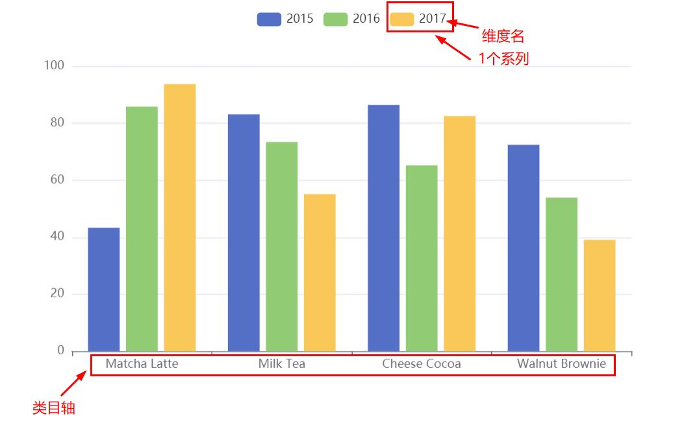

### 自定义南丁格尔图

配置 | 作用
:-: | :-: 
backgroundColor | 全局设置背景色
series.roseType | 显示成南丁格尔图，通过半径表示数据的大小
series.data... | 数组元素排序  
series.itemStyle | 添加阴影效果
series.itemStyle | 设置扇形的颜色
series.label.color | 设置该系列的文本颜色
series.labelLine.lineStyle.color | 设置视觉引导线的颜色  
visualMap.min | 与下面的属性共同形成视觉映射的定义域  
visualMap.max | 即程度的两个端值，与下面定义的范围相联系  
visualMap.inRange | 定义范围内的[视觉元素](https://echarts.apache.org/zh/option.html#visualMap-continuous.inRange)
series.animationType | 动画类型
series.animationEasing | 初始动画的[缓动效果](https://echarts.apache.org/examples/zh/editor.html?c=line-easing)
series.animationDelay | 初始动画的延迟，支持回调函数

```
option = {
    backgroundColor: '#2c343c', 
    series: [
        {
            name: '访问来源',
            type: 'pie',
            radius: '55%',
            roseType: true,
            data:[
                {value:235, name:'视频广告'},
                {value:274, name:'联盟广告'},
                {value:310, name:'邮件营销'},
                {value:335, name:'直接访问'},
                {value:400, name:'搜索引擎'}
            ].sort(function (a, b) { return a.value - b.value; }),
            label: {
                color: 'rgba(255, 255, 255, 0.3)'
            },
            labelLine: {
                lineStyle: {
                    color: 'rgba(255, 255, 255, 0.3)'
                }
            },
            itemStyle: {
                // 设置扇形的颜色
                color: '#c23531',
                color: 'skyblue',
                // 设置扇形的阴影  
                shadowBlur: 200,
                shadowColor: 'rgba(0, 0, 0, 0.5)'
            },
            /* 动画效果 */
            animationType: 'scale',
            animationEasing: 'elasticOut',
            animationDelay: function (idx) {
                // 随机延时
                return Math.random() * 200;
                // 越往后越迟
                return idx * 100;
            }
        },
    ],
    visualMap: {
        // 不显示 visualMap 组件，只用于明暗度的映射
        show: false,
        // 映射的最小值为 80
        min: 80,
        // 映射的最大值为 600
        max: 600,
        inRange: {
            // 明暗度的范围是 0 到 1
            colorLightness: [0, 1]
        }
    }
}
```

### 样式简介

#### 颜色主题（Theme）
> 默认主题有 `'light'` 和 `'dark'`，在[初始化实例](https://github.com/SpringLoach/Vue/blob/main/plugins/ECharts/base.md#echarts的基本使用)时，将相应字符串作为第二个参数即可。  

　　1\. 需要使用其它主题时，可以在 [主题编辑器](https://echarts.apache.org/zh/theme-builder.html) 中按需修改、下载。  

　　2\. 下载主题 -> JS 版本 -> 将文件保存至 `*.js` 
  
　　3\. 在 HTML 中引用该文件 -> 初始化实例时，将对应的 `'*'` 作为注册的主题名字，即第二参。  

#### 调色盘  
> 值为 11 个颜色字符串组成的数组。  

配置 | 作用
:-: | :-: 
color | 全局调色盘
系列中的 color | 系列专属调色盘  

#### 直接的样式设置  
> 纵观 ECharts 的 option 中，很多地方可以设置 itemStyle、lineStyle、areaStyle、label 等等。 
> 
> 分别对应图形样式、线样式、...、标签样式。

#### 高亮样式emphasis 
> 即鼠标悬浮到图形元素上时的样式，该属性中的结构与普通样式的结构相同。  
> 
> 该属性作为 itemStyle（普通样式）的属性存在。  

### 异步数据加载和更新  
> 在图表初始化后不管任何时候再通过 `setOption` 填入数据和配置项就行。  
> 
> 在更新数据的时候推荐给系列添加上 `name` 属性以正常更新。  

#### loading动画
> ECharts 默认提供一个简单的加载动画，告诉用户数据正在加载。  

实例方法 | 作用 | 说明
:-: | :-: | :-: 
myChart.showLoading() | 显示加载动画 | /
myChart.hideLoading() | 隐藏加载动画 | 获取数据后调用  

#### 数据的动态更新  
> 所有数据的更新都通过 setOption 实现，ECharts 会找到两组数据之间的差异然后通过合适的动画去表现数据的变化。  
> 
> 如果只需要加入单个数据，可以先 data.push(value) 后 setOption。  

----

### 使用dataset管理数据  
> 可以单独管理数据，并使数据被多个组件复用。  

#### 简单柱状图

配置 | 作用 | 默认
:-: | :-: | :-: 
legend | 启用图例组件 | /
tooltip | 启用提示框组件 | /
dataset.source | 提供数据 | /  
xAxis.type = 'category' | 声明一个 X 轴为类目轴 | 类目轴对应 dataset 首列
yAxis | 声明一个 Y 轴，数值轴 | /
series 对象数组 | 声明多个系列 | 每个系列会自动对应到 dataset 的下一列
.. | .. | 自动判断维度首项是否为维度名

```
option = {
    legend: {},
    tooltip: {},
    dataset: {
        source: [
            ['product', '2015', '2016', '2017'],
            ['Matcha Latte', 43.3, 85.8, 93.7],
            ['Milk Tea', 83.1, 73.4, 55.1],
            ['Cheese Cocoa', 86.4, 65.2, 82.5],
            ['Walnut Brownie', 72.4, 53.9, 39.1]
        ]
    },
    xAxis: {type: 'category'},
    yAxis: {},
    series: [
        {type: 'bar'},
        {type: 'bar'},
        {type: 'bar'}
    ]
}
```

  

也可以使用常见的对象数组的格式，用 dimensions 指定维度的顺序，它们不支持 [seriesLayoutBy](https://github.com/SpringLoach/Vue/blob/main/plugins/ECharts/直角坐标系.md#series)。  

 ```
 dataset: {
    // 此时系列对应的列顺序为 '2017' →  '2016' → '2015'
    dimensions: ['product', '2017', '2016', '2015'],
    source: [
        {product: 'Matcha Latte', '2015': 43.3, '2016': 85.8, '2017': 93.7},
        {product: 'Milk Tea', '2015': 83.1, '2016': 73.4, '2017': 55.1},
        {product: 'Cheese Cocoa', '2015': 86.4, '2016': 65.2, '2017': 82.5},
        {product: 'Walnut Brownie', '2015': 72.4, '2016': 53.9, '2017': 39.1}
    ]
}
```

```
// 内部也可以这样
source: {
    'product': ['Matcha Latte', 'Milk Tea', 'Cheese Cocoa', 'Walnut Brownie'],
    'count': [823, 235, 1042, 988],
    'score': [95.8, 81.4, 91.2, 76.9]
}
```

#### 数据到图形的映射   
> 默认情况下，将使用每一列作为一个维度，即按列映射。  
> 
> 未指定映射关系时：X 坐标轴声明为类目轴，对应到 dataset.source 中的第一列，每个系列对应到往后的一列。  

可以通过 series.[seriesLayoutBy](https://github.com/SpringLoach/Vue/blob/main/plugins/ECharts/直角坐标系.md#series)，指定按行映射  

```
series: [
  {type: 'bar', seriesLayoutBy: 'row'},
  {type: 'bar', seriesLayoutBy: 'row'},
  {type: 'bar', seriesLayoutBy: 'row'}
]
```

#### 维度  
> 当把系列对应到列时，每一列就称为一个维度。  
> 
> 维度可以有单独的名字，便于在图表中显示。

**#维度名称**   
> ECharts 默认会自动探测 `dataset.source` 中第一行/列是否包含维度名。  
> 
> 可以设置 `dataset.sourceHeader: true` 显示声明第一行（列）就是维度名。  

**#单独定义维度**  
> 可以使用 dataset.dimensions 或 series.dimensions 来定义维度名和维度类型。  

序号 | 说明 
:-: | :-: 
Ⅰ | 值为数组，数组元素可以是 *str*，表示维度名
Ⅱ | 数组元素也可以是 null，表示不设置维度名
Ⅲ | 数组元素也可以是 *obj*，配置 name 和 type
Ⅳ | 系列的 `dimensions` 属性优先级更高  

type | 维度类型/说明 
:-: | :-: 
'number' | 默认，普通数据
'ordinal' | str 类型的数据
'time' | 时间数据
'float' | 存储时使用 TypedArray，性能较好
'int' | 存储时使用 TypedArray，性能较好

#### 数据到图形的映射(series.encode)  
> 使用该属性可以通过 维度名称 或 维度的序号 来指定映射到某个坐标轴的维度，也可以设置标签、提示框、[指定系列名等](https://echarts.apache.org/zh/tutorial.html#使用%20dataset%20管理数据)。  

```
series: [
  {
    type: 'bar',
    // 将维度名称为 `amount` 的列设为 X 轴，第六列设为 Y 轴
    encode: {
      x: 'amount',
      y: 5
    }
  }
]
```

#### 默认的encode  
> 当没有指定 `series.encode` 时，ECharts 会采用一些默认的映射规则。  

坐标系 | 栗子 | 条件 | 默认映射规则
:-: | :-: | :-: | :-:
√ | 直角坐标系 | 有类目轴 | 第一列映射到类目轴上，后续每列对应一个系列  
√ | 直角坐标系 | 无类目轴，两个轴 | 每两列对应一个系列
× | 饼图 | 两列 | 名字，数值
× | 饼图 | 一列 | 数值

#### 多个dataset的使用  
> 存在多个数据集组件时，在系列中使用 datasetIndex 指定使用的数据集。  

```
var option = {
    dataset: [{
        source: [...],
    }, {
        source: [...]
    }],
    series: [{
        datasetIndex: 0
    }, {
        datasetIndex: 1
    }]
}
```

#### 系列中的数据  
> series.data 会有更高的优先级。  
> 
> 并非所有图表类型都支持数据集。  


